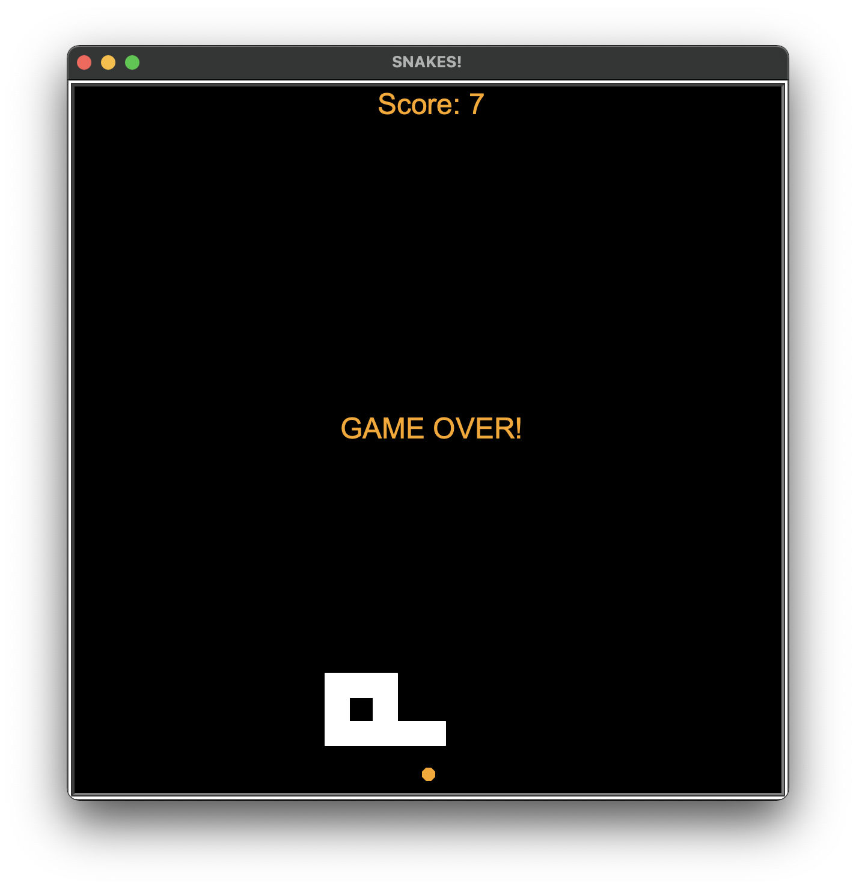

<div id="top"></div>

<!-- PROJECT SHIELDS -->
<!--
*** I'm using markdown "reference style" links for readability.
*** Reference links are enclosed in brackets [ ] instead of parentheses ( ).
*** See the bottom of this document for the declaration of the reference variables
*** for contributors-url, forks-url, etc. This is an optional, concise syntax you may use.
*** https://www.markdownguide.org/basic-syntax/#reference-style-links
-->


<!-- PROJECT LOGO -->
<br />
<div align="center">
  <a href="simple command-line blackjack game">
    
  </a>

<h3 align="center">Snake Game</h3>

  <p align="center">
    Classic Snake game, recreated in Python using the Turtle library
    <br />
    <a href="https://github.com/Seth-Scott/snake_game><strong>Explore the docs</strong></a>
    <br />
    <br />
    <a href="https://github.com/Seth-Scott/snake_game/issues"><Report Bug</a>
  </p>
</div>


<!-- ABOUT THE PROJECT -->
## About The Project




A GUI recreation of the classic Snake game!

<p align="right">(<a href="#top">back to top</a>)</p>


### Built With

* [Python 3.10](https://www.python.org/downloads/release/python-3100/)


<p align="right">(<a href="#top">back to top</a>)</p>


<!-- GETTING STARTED -->
## Getting Started

### Terminal Installation

1. Make sure Python 3.10 is installed.
2. Clone the repo:
```
$ git clone git@github.com:Seth-Scott/snake_game.git
```
3. Navigate to the directory:
```
$ cd /snakegame
```
4. Create the virtual environment:
```
$ python3.10 -m venv venv
```
5. Launch the virtual environment:
```
cd ./venv/bin/
source activate
```
6. launch the game!
```
$ python3.10 main.py
```

NOTE: This project uses the `Turtle` library, which should be preinstalled with `Python 3.10`, but many not come equipped with earlier versions. 


<p align="right">(<a href="#top">back to top</a>)</p>


<!-- CONTRIBUTING -->
## Contributing

Contributions are what make the open source community such an amazing place to learn, inspire, and create. Any contributions you make are **greatly appreciated**.

If you have a suggestion that would make this better, please fork the repo and create a pull request. You can also simply open an issue with the tag "enhancement".
Don't forget to give the project a star! Thanks again!

1. Fork the Project
2. Create your Feature Branch (`git checkout -b feature/AmazingFeature`)
3. Commit your Changes (`git commit -m 'Add some AmazingFeature'`)
4. Push to the Branch (`git push origin feature/AmazingFeature`)
5. Open a Pull Request

<p align="right">(<a href="#top">back to top</a>)</p>

<!-- MARKDOWN LINKS & IMAGES -->
<!-- https://www.markdownguide.org/basic-syntax/#reference-style-links -->
[contributors-shield]: https://img.shields.io/github/contributors/github_username/repo_name.svg?style=for-the-badge
[contributors-url]: https://github.com/github_username/repo_name/graphs/contributors
[forks-shield]: https://img.shields.io/github/forks/github_username/repo_name.svg?style=for-the-badge
[forks-url]: https://github.com/github_username/repo_name/network/members
[stars-shield]: https://img.shields.io/github/stars/github_username/repo_name.svg?style=for-the-badge
[stars-url]: https://github.com/github_username/repo_name/stargazers
[issues-shield]: https://img.shields.io/github/issues/github_username/repo_name.svg?style=for-the-badge
[issues-url]: https://github.com/github_username/repo_name/issues
[license-shield]: https://img.shields.io/github/license/github_username/repo_name.svg?style=for-the-badge
[license-url]: https://github.com/github_username/repo_name/blob/master/LICENSE.txt
[linkedin-shield]: https://img.shields.io/badge/-LinkedIn-black.svg?style=for-the-badge&logo=linkedin&colorB=555
[linkedin-url]: https://linkedin.com/in/linkedin_username
